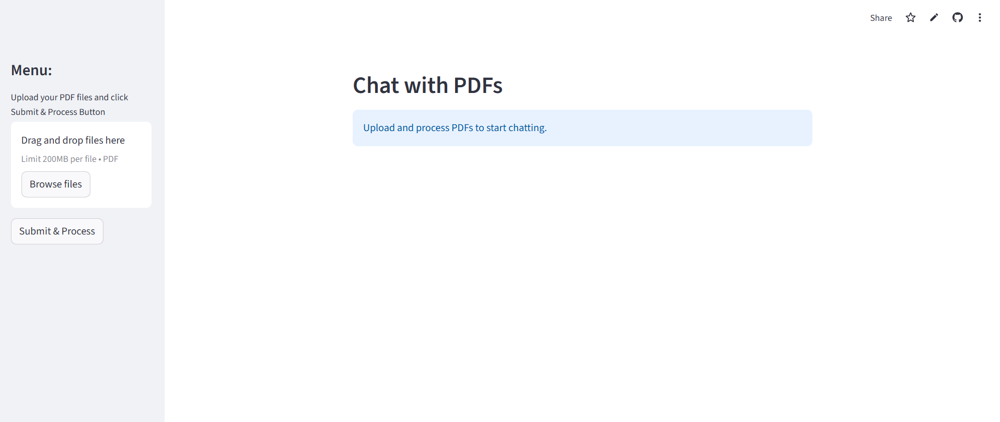

# 📄 PDF Chatbot

A conversational chatbot that allows you to upload PDFs and ask questions about their content. Built with **Streamlit**, **LangChain**, **FAISS**, and **Groq API**.



---

## ✨ Features
- **Upload multiple PDFs** and ask questions about their content.
- **Conversational interface** for a natural chat experience.
- **Local vector database** (FAISS) for fast and efficient document retrieval.
- **Modern UI** with custom styling and avatars.

---

## 🛠️ Setup

### Prerequisites
- Python 3.8 or higher
- Git
- A [Groq API key](https://groq.com/) (for the chatbot's LLM)

### Installation
1. **Clone the repository**:
   ```bash
   git clone https://github.com/Sridhar016/PDF-Chatbot.git
   cd PDF-Chatbot
2. **Create a virtual environment (recommended)**:
   ```bash
   python -m venv venv
   venv\Scripts\Activate
   ```
3. **Install dependencies**:
   ```bash
   pip install -r requirements.txt
   ```
4. **Set up your secrets.toml file**:
   - Create a .streamlit directory in your project root if it doesn't exist:
   - Inside the .streamlit directory, create a secrets.toml file:
   - Add your Groq API key to secrets.toml:
   ```bash
   GROQ_API_KEY = "your_api_key_here"
   ```
6. **Run the app**:
   ```bash
   streamlit run app.py
   ```
---
## Usage
- Upload PDFs: Use the sidebar to upload one or more PDF files.
- Process Documents: Click the "Submit & Process" button to extract and index the text.
- Ask Questions: Type your questions in the chat input and get answers based on the PDF content.
---
## Project Structure
```bash
your-repo/
├── app.py                # Main application code
├── requirements.txt      # Python dependencies
├── .streamlit/           # Streamlit configuration and secrets
│   └── secrets.toml      # API keys (not tracked)
├── faiss_index/          # Local FAISS vector store (not tracked)
├── uploaded/             # User-uploaded PDFs (not tracked)
└── README.md             # Project documentation
```
---
## 📦 Dependencies
- streamlit: Web app framework
- langchain: Framework for building LLM-powered applications
- faiss-cpu or faiss-gpu: Vector similarity search
- PyPDF2: PDF text extraction
- python-dotenv: Environment variable management (if used)
- groq: Groq API client

---


